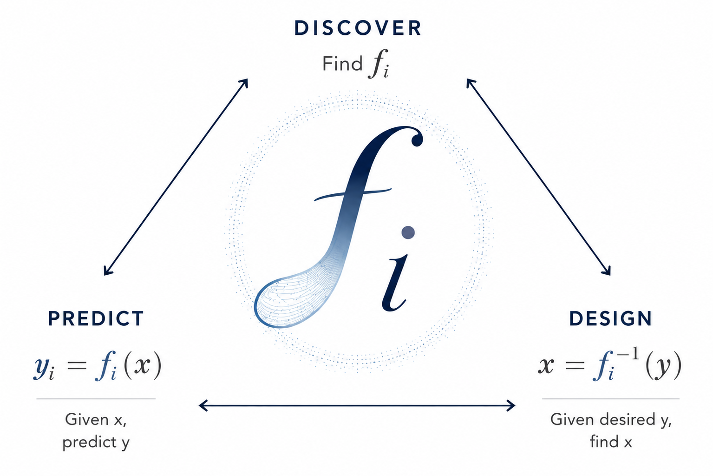

```{=html}
<main class="home" aria-labelledby="home-title">
  <nav class="home-navbar" aria-label="Primary navigation">
    <div class="home-nav-links">
      <a href="insights.qmd">Insights</a>
      <a href="people.qmd">People</a>
      <a href="research.qmd">Research</a>
      <a href="publications.qmd">Publications</a>
      <a href="upcoming.qmd">Upcoming</a>
      <a href="fun.qmd">Fun</a>
      <a href="support.qmd">Support</a>
      <a href="join.qmd">Join</a>
      <a href="contact.qmd">Contact</a>
      <a href="zh/index.qmd" lang="zh-CN">中文版</a>
    </div>
  </nav>

  <h1 id="home-title">Feng Lab</h1>

  <section class="home-layout" aria-label="Feng Lab mission and scientific framework">
    <div class="mission-note">
      <p>Every individual carries a unique immune system, shaped by shared biological principles, genetics, development, environment, and life experiences.</p>
      <p>Our goal is to uncover the algorithms that govern these immune systems, enabling a future in which immune health can be understood, predicted, and improved for every individual.</p>
    </div>

    <figure class="philosophy-figure">
      
    </figure>
  </section>
</main>
```
