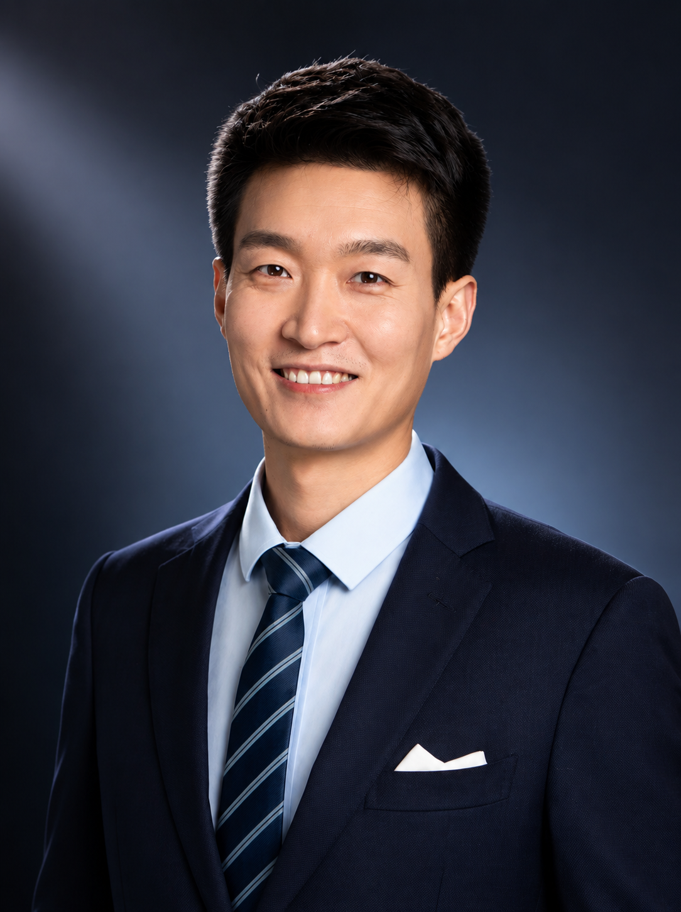
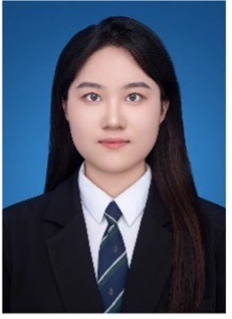
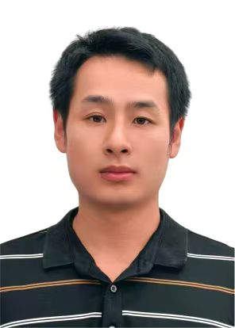
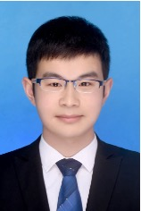
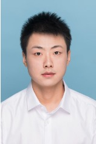

```{=html}
<main class="people-main">
<header class="people-intro people-intro-minimal">
<h1 class="visually-hidden">People</h1>
<p class="people-deck">We respect <span class="people-highlight">people</span>, and we respect life.</p>
</header>
<section class="pi-section" aria-labelledby="pi-heading">
<h2 class="group-lead-title">Group Leader</h2>
<div class="pi-overview">
<figure class="pi-portrait">

</figure>
<div class="pi-profile">
<h2 id="pi-heading">Yupeng Feng, Ph.D.</h2>
<dl class="pi-details">
<div>
<dt>Title</dt>
<dd>Principal Investigator</dd>
</div>
<div>
<dt>Affiliation</dt>
<dd>Hangzhou Institute of Medicine (HIM), Chinese Academy of Sciences</dd>
</div>
<div>
<dt>Email</dt>
<dd><a href="mailto:fengyupeng@him.cas.cn">fengyupeng@him.cas.cn</a>; <a href="mailto:fengyupeng@outlook.com">fengyupeng@outlook.com</a></dd>
</div>
</dl>
</div>
</div>
<div class="pi-biography">
<div class="pi-biography-copy">
<p>Yupeng Feng studies how the human immune system develops, adapts, and responds to biological challenges. By integrating immunology, single-cell multi-omics, proteomics, and computational biology, FengLab seeks to uncover the principles governing individual immune responses and advance personalized human health.</p>
</div>
</div>
</section>
<section class="members-section" aria-label="Lab members">
<h2 class="members-title">Group Members</h2>
<!-- Duplicate a member-profile article below to add a future member. -->
<article class="member-profile" aria-label="Liu Wei profile">

<div class="member-content">
<h3>Liu Wei, M.S.</h3>
<dl class="member-details">
<div>
<dt>Title</dt>
<dd>Lab Administrator</dd>
</div>
<div>
<dt>Affiliation</dt>
<dd>Hangzhou Institute of Medicine (HIM), Chinese Academy of Sciences</dd>
</div>
<div>
<dt>Email</dt>
<dd><a href="mailto:liuwei@him.cas.cn">liuwei@him.cas.cn</a></dd>
</div>
<div>
<dt>Joined</dt>
<dd>September 2025</dd>
</div>
<div>
<dt>Expertise</dt>
<dd>M.S. in Pharmacology, China Medical University</dd>
</div>
</dl>
</div>
</article>
<article class="member-profile" aria-label="Guo Lina profile">

<div class="member-content">
<h3>Guo Lina, M.S.</h3>
<dl class="member-details">
<div>
<dt>Title</dt>
<dd>Life Science Research Professional</dd>
</div>
<div>
<dt>Affiliation</dt>
<dd>Hangzhou Institute of Medicine (HIM), Chinese Academy of Sciences</dd>
</div>
<div>
<dt>Email</dt>
<dd><a href="mailto:2570874851@qq.com">2570874851@qq.com</a></dd>
</div>
<div>
<dt>Joined</dt>
<dd>December 2025</dd>
</div>
<div>
<dt>Expertise</dt>
<dd>M.S. in Cell Biology; development of chemiluminescence assay kits.</dd>
</div>
</dl>
</div>
</article>
<article class="member-profile" aria-label="Wang Jianfeng profile">

<div class="member-content">
<h3>Wang Jianfeng</h3>
<dl class="member-details">
<div>
<dt>Title</dt>
<dd>Life Science Research Professional</dd>
</div>
<div>
<dt>Affiliation</dt>
<dd>Hangzhou Institute of Medicine (HIM), Chinese Academy of Sciences</dd>
</div>
<div>
<dt>Email</dt>
<dd><a href="mailto:1018770369@qq.com">1018770369@qq.com</a></dd>
</div>
<div>
<dt>Joined</dt>
<dd>October 2025</dd>
</div>
<div>
<dt>Expertise</dt>
<dd>In vitro diagnostic (IVD) development.</dd>
</div>
</dl>
</div>
</article>
<article class="member-profile" aria-label="Geng Hongen profile">

<div class="member-content">
<h3>Geng Hongen, Ph.D.</h3>
<dl class="member-details">
<div>
<dt>Title</dt>
<dd>Postdoctoral Fellow</dd>
</div>
<div>
<dt>Affiliation</dt>
<dd>Hangzhou Institute of Medicine (HIM), Chinese Academy of Sciences</dd>
</div>
<div>
<dt>Email</dt>
<dd><a href="mailto:genghongen@him.cas.cn">genghongen@him.cas.cn</a></dd>
</div>
<div>
<dt>Joined</dt>
<dd>February 2026</dd>
</div>
<div>
<dt>Expertise</dt>
<dd>Ph.D. in Organic Chemistry (Chemical Biology), Central China Normal University; proteomics, with six years of experience across the complete mass spectrometry-based workflow, from sample preparation to data analysis.</dd>
</div>
</dl>
</div>
</article>
<article class="member-profile" aria-label="Wang Longyu profile">

<div class="member-content">
<h3>Wang Longyu, Ph.D.</h3>
<dl class="member-details">
<div>
<dt>Title</dt>
<dd>Postdoctoral Fellow</dd>
</div>
<div>
<dt>Affiliation</dt>
<dd>Hangzhou Institute of Medicine (HIM), Chinese Academy of Sciences</dd>
</div>
<div>
<dt>Email</dt>
<dd><a href="mailto:wanglongyu@him.cas.cn">wanglongyu@him.cas.cn</a></dd>
</div>
<div>
<dt>Joined</dt>
<dd>March 2026</dd>
</div>
<div>
<dt>Expertise</dt>
<dd>Ph.D. in Pathogenic Biology; structural characterization of viral surface glycoproteins and neutralizing antibodies; evaluation of viral neutralizing antibodies and vaccines.</dd>
</div>
</dl>
</div>
</article>
</section>
<section class="alumni-section" aria-labelledby="alumni-heading">
<h2 id="alumni-heading" class="alumni-title">Alumni</h2>
<p>Alumni names, roles in FengLab, and current positions will be added here as the lab community grows.</p>
</section>
</main>
```
