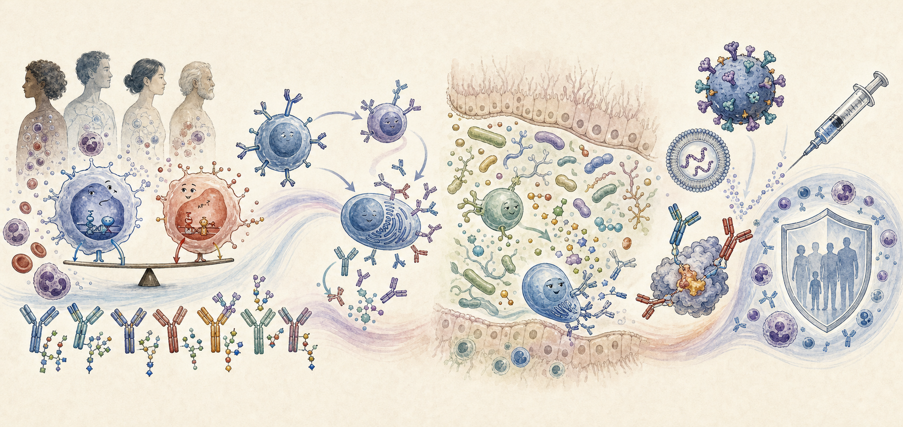
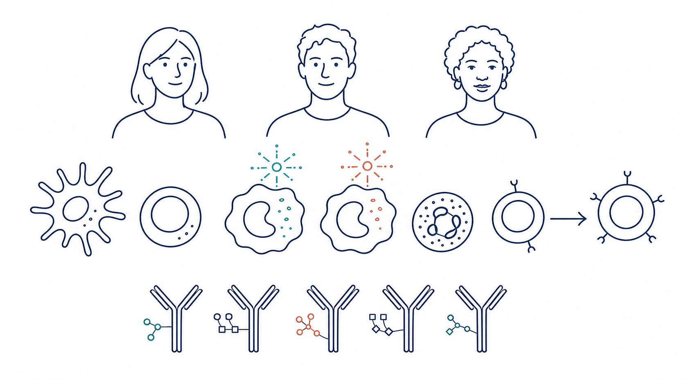
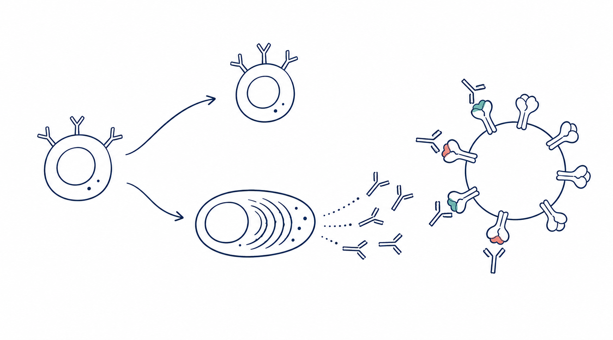
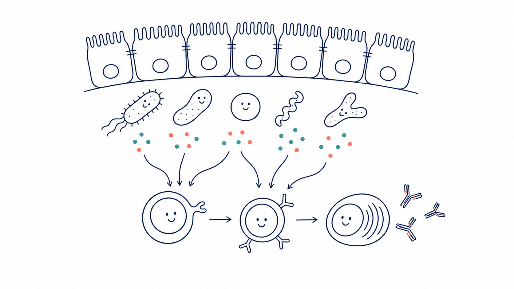
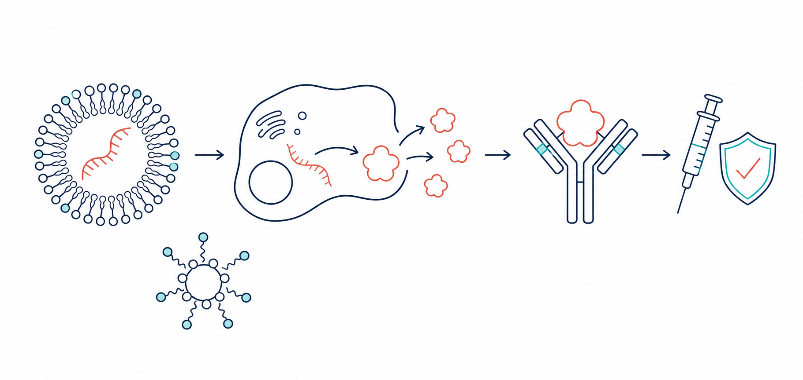

```{=html}
<main class="research-main">
<header class="research-hero">
<p class="research-kicker">Our scientific program</p>
<h1>From immune baseline<br>to immune outcome.</h1>
<p class="research-lead">Why do people respond differently to the same biological challenge? We study how pre-existing immune states interact with vaccines, infection, and other perturbations to shape the magnitude, quality, breadth, and durability of human immunity.</p>
</header>

<figure class="research-illustration">

</figure>

<section class="research-question" aria-labelledby="research-question-heading">
<p class="research-section-label">The central question</p>
<div>
<h2 id="research-question-heading">Can an individual immune response be understood, predicted, and ultimately improved?</h2>
<p>We connect immune state before a challenge with the cellular trajectories that follow it. This framework lets us move beyond population averages toward mechanistic and personalized models of human immunity.</p>
</div>
</section>

<section class="research-programs" aria-labelledby="programs-heading">
<div class="research-heading-row">
<p class="research-section-label">Research programs</p>
<h2 id="programs-heading">Four connected scales of discovery</h2>
</div>

<article class="research-program">
<div class="program-number">01</div>
<div class="program-title">
<p>Before the response</p>
<h3>Immune baselines and response trajectories</h3>
</div>
<div class="program-copy">
<p>We define the immune states that exist before vaccination or infection and determine how they shape what happens next. A current focus is the balance between interferon-linked and inflammatory programs in monocytes, including the IRF and AP-1 regulatory axes, and how these programs influence T-cell priming and functional fate. We also profile the glycosylation landscape of bulk human immunoglobulins as a systems-level readout of immune state and regulation.</p>
<ul>
<li>Individual immune-state variation</li>
<li>Human bulk-Ig glycosylation</li>
<li>Innate-to-adaptive immune coupling</li>
<li>Predictive biomarkers of response</li>
</ul>
</div>
<figure class="program-illustration">

</figure>
</article>

<article class="research-program">
<div class="program-number">02</div>
<div class="program-title">
<p>Making protection last</p>
<h3>B-cell fate and antibody quality</h3>
</div>
<div class="program-copy">
<p>We investigate how early immune activation shapes memory B cells, long-lived plasma cells, and the evolution of neutralizing antibody lineages. Our goal is to uncover the cellular rules that determine whether an antibody response becomes durable, broad, and protective.</p>
<ul>
<li>Long-lived plasma-cell generation</li>
<li>Memory B-cell and antibody lineage evolution</li>
<li>Durability and breadth of neutralization</li>
</ul>
</div>
<figure class="program-illustration">

</figure>
</article>

<article class="research-program">
<div class="program-number">03</div>
<div class="program-title">
<p>The host environment</p>
<h3>Microbiome–metabolism–immunity</h3>
</div>
<div class="program-copy">
<p>We study how the gut microbiome and its metabolites calibrate immune homeostasis and vaccine responsiveness. By combining prospective human perturbation studies with multi-omics and functional experiments, we seek causal links among microbial communities, metabolic signals, T-cell help, and antibody production.</p>
<ul>
<li>Human microbiome perturbation studies</li>
<li>Metabolic control of immune function</li>
<li>Microbiome-informed intervention strategies</li>
</ul>
</div>
<figure class="program-illustration">

</figure>
</article>

<article class="research-program">
<div class="program-number">04</div>
<div class="program-title">
<p>From mechanism to design</p>
<h3>Precision vaccinology</h3>
</div>
<div class="program-copy">
<p>We translate immune mechanisms into better vaccination and antibody strategies. We examine how antigen architecture, adjuvants, dosing, and delivery systems—including nanoparticle and LNP–mRNA platforms—reshape immune trajectories in infectious disease and cancer. This program also includes mRNA-based PD vaccines and antibody discovery and development.</p>
<ul>
<li>Antigen and adjuvant design</li>
<li>mRNA-based PD vaccines and antibodies</li>
<li>Systems-level vaccine evaluation</li>
<li>Mechanism-guided immune intervention</li>
</ul>
</div>
<figure class="program-illustration">

</figure>
</article>
</section>

<section class="research-approach" aria-labelledby="approach-heading">
<div class="research-heading-row">
<p class="research-section-label">How we work</p>
<h2 id="approach-heading">Human immunology across scales</h2>
</div>
<div class="approach-flow" aria-label="Research workflow">
<div class="approach-step">
<span>01</span>
<h3>Observe</h3>
<p>Longitudinal human cohorts and precisely timed biological samples.</p>
</div>
<div class="approach-step">
<span>02</span>
<h3>Measure</h3>
<p>Single-cell multi-omics, proteomics, immune profiling, and antibody analysis.</p>
</div>
<div class="approach-step">
<span>03</span>
<h3>Model</h3>
<p>Computational integration of baseline states and response trajectories.</p>
</div>
<div class="approach-step">
<span>04</span>
<h3>Test</h3>
<p>Functional perturbation, experimental models, and causal validation.</p>
</div>
</div>
</section>

<section class="research-close">
<p class="research-section-label">The goal</p>
<p>To discover the individual immune function: a mechanistic map connecting who a person is immunologically, what challenge they encounter, and how their immune system will respond.</p>
</section>
</main>
```
