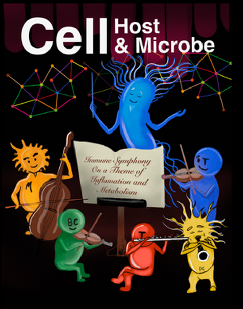
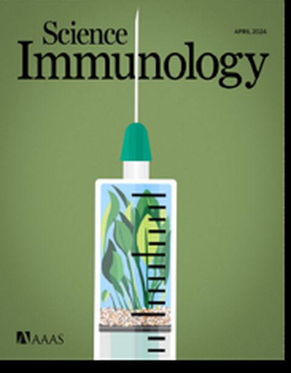
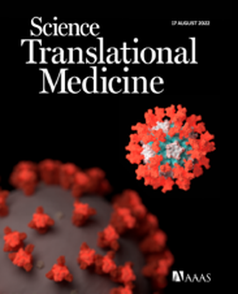

```{=html}
<main class="publications-main" aria-labelledby="publications-title">
  <header class="publications-header">
    <div class="publications-heading">
      <p class="publications-kicker">FengLab 研究成果</p>
      <h1 id="publications-title">论文</h1>
      <p class="publications-intro">我们的研究涵盖人类系统免疫学、疫苗应答、抗体发现，以及微生物组与免疫功能之间的相互作用。</p>
    </div>

    <aside class="publications-profile" aria-label="论文档案">
      <span class="publications-fi" aria-hidden="true">f<sub>i</sub></span>
      <p>最新引用数据及完整论文记录，请查看 Google Scholar 个人主页。</p>
      <a href="https://scholar.google.com/citations?user=msJAq4wAAAAJ&amp;hl=en">查看 Google Scholar <span aria-hidden="true">↗</span></a>
    </aside>
  </header>

  <section class="publication-feature" aria-labelledby="featured-publication-title">
    <div class="publication-feature-label">
      <span>精选论文</span>
      <span>2025</span>
    </div>
    <div class="publication-feature-copy">
      <p class="publication-journal">Cell Host &amp; Microbe · 33(5), 705–718.e5</p>
      <h2 id="featured-publication-title"><a href="https://www.cell.com/cell-host-microbe/fulltext/S1931-3128(25)00126-X">抗生素诱导的肠道微生物组扰动改变狂犬病疫苗的免疫应答</a></h2>
      <p>本研究探讨抗生素引起的肠道微生物组扰动如何影响狂犬病疫苗接种后的免疫应答。</p>
      <a class="publication-read" href="https://www.cell.com/cell-host-microbe/fulltext/S1931-3128(25)00126-X">查看论文 <span aria-hidden="true">→</span></a>
    </div>
  </section>

  <section class="cover-features" aria-labelledby="cover-features-title">
    <div class="cover-features-heading">
      <div>
        <p class="publications-kicker">期刊重点呈现</p>
        <h2 id="cover-features-title">封面论文</h2>
      </div>
      <p>三项研究获选期刊封面论文，展现了我们在疫苗设计、记忆 B 细胞生物学以及微生物组–免疫调控方面的工作。</p>
    </div>
    <div class="cover-features-grid">
      <article class="cover-feature-card">
        <a class="cover-feature-image" href="https://www.cell.com/cell-host-microbe/fulltext/S1931-3128(25)00126-X">
          
        </a>
        <p class="cover-feature-meta">Cell Host &amp; Microbe · 2025 年 5 月</p>
        <h3><a href="https://www.cell.com/cell-host-microbe/fulltext/S1931-3128(25)00126-X">抗生素诱导的肠道微生物组扰动改变狂犬病疫苗的免疫应答</a></h3>
      </article>
      <article class="cover-feature-card">
        <a class="cover-feature-image" href="https://www.science.org/doi/10.1126/sciimmunol.adi8039">
          
        </a>
        <p class="cover-feature-meta">Science Immunology · 2024 年 4 月</p>
        <h3><a href="https://www.science.org/doi/10.1126/sciimmunol.adi8039">AS03 佐剂增强记忆 B 细胞应答的幅度、持久性与克隆广度</a></h3>
      </article>
      <article class="cover-feature-card">
        <a class="cover-feature-image" href="https://www.science.org/doi/10.1126/scitranslmed.abq4130">
          
        </a>
        <p class="cover-feature-meta">Science Translational Medicine · 2022 年 8 月</p>
        <h3><a href="https://www.science.org/doi/10.1126/scitranslmed.abq4130">佐剂型亚单位疫苗可诱导针对 SARS-CoV-2 奥密克戎变异株的持久保护</a></h3>
      </article>
    </div>
  </section>

  <section class="publication-archive" aria-labelledby="publication-archive-title">
    <div class="publication-archive-heading">
      <div>
        <p class="publications-kicker">论文记录</p>
        <h2 id="publication-archive-title">研究论文</h2>
      </div>
      <p>按时间倒序排列。论文标题链接至期刊或出版商的原始页面。</p>
    </div>

    <section class="publication-year" aria-labelledby="publications-2025">
      <h3 id="publications-2025">2025</h3>
      <div class="publication-list">
        <article class="publication-item">
          <p class="publication-journal">Cell Host &amp; Microbe · 33(5), 705–718.e5</p>
          <h4><a href="https://www.cell.com/cell-host-microbe/fulltext/S1931-3128(25)00126-X">抗生素诱导的肠道微生物组扰动改变狂犬病疫苗的免疫应答</a></h4>
        </article>
        <article class="publication-item">
          <p class="publication-journal">Cell Reports Medicine · 6(4)</p>
          <h4><a href="https://www.cell.com/cell-reports-medicine/fulltext/S2666-3791(25)00123-5">肺移植受者基线免疫状态改变且对 SARS-CoV-2 mRNA 疫苗的免疫应答受损</a></h4>
        </article>
      </div>
    </section>

    <section class="publication-year" aria-labelledby="publications-2024">
      <h3 id="publications-2024">2024</h3>
      <div class="publication-list">
        <article class="publication-item">
          <p class="publication-journal">Science Immunology · 9(94), eadi8039</p>
          <h4><a href="https://www.science.org/doi/10.1126/sciimmunol.adi8039">AS03 佐剂增强植物源 COVID-19 疫苗在人群中诱导的记忆 B 细胞应答幅度、持久性与克隆广度</a></h4>
        </article>
        <article class="publication-item">
          <p class="publication-journal">Science Translational Medicine · 16(758), eadn6605</p>
          <h4><a href="https://www.science.org/doi/10.1126/scitranslmed.adn6605">在非人灵长类动物中对 R21 疟疾疫苗多种临床阶段佐剂进行比较免疫学评估</a></h4>
        </article>
      </div>
    </section>

    <section class="publication-year" aria-labelledby="publications-2023">
      <h3 id="publications-2023">2023</h3>
      <div class="publication-list">
        <article class="publication-item">
          <p class="publication-journal">Journal of Clinical Investigation · 133(10)</p>
          <h4><a href="https://www.jci.org/articles/view/167955">COVID-19 mRNA 加强免疫应答的持久性</a></h4>
        </article>
        <article class="publication-item">
          <p class="publication-journal">Nature Immunology · 24(2), 337–348</p>
          <h4><a href="https://www.nature.com/articles/s41590-022-01376-y">SREBP 信号对有效的 B 细胞应答至关重要</a></h4>
        </article>
        <article class="publication-item">
          <p class="publication-journal">Cell · 186(21), 4632–4651.e23</p>
          <h4><a href="https://www.cell.com/cell/fulltext/S0092-8674(23)00978-9">出生后针对 SARS-CoV-2 的黏膜与全身免疫多组学分析</a></h4>
        </article>
        <article class="publication-item">
          <p class="publication-journal">Science Translational Medicine · 15(695), eadg7404</p>
          <h4><a href="https://www.science.org/doi/10.1126/scitranslmed.adg7404">以 AS03 佐剂 COVID-19 疫苗免疫猕猴产生针对沙贝病毒的广谱中和抗体</a></h4>
        </article>
      </div>
    </section>

    <section class="publication-year" aria-labelledby="publications-2022">
      <h3 id="publications-2022">2022</h3>
      <div class="publication-list">
        <article class="publication-item">
          <p class="publication-journal">Nature Immunology · 23(4), 543–555</p>
          <h4><a href="https://www.nature.com/articles/s41590-022-01163-9">辉瑞–BioNTech BNT162b2 疫苗诱导先天性与适应性免疫的机制</a></h4>
        </article>
        <article class="publication-item">
          <p class="publication-journal">Science Translational Medicine · 14(658), eabq4130</p>
          <h4><a href="https://www.science.org/doi/10.1126/scitranslmed.abq4130">佐剂型亚单位疫苗可诱导针对 SARS-CoV-2 奥密克戎变异株的持久保护</a></h4>
        </article>
        <article class="publication-item">
          <p class="publication-journal">npj Vaccines · 7, 55</p>
          <h4><a href="https://www.nature.com/articles/s41541-022-00472-2">使用具有临床相关性的佐剂增强 SARS-CoV-2 亚单位疫苗，可在小鼠中诱导持久保护</a></h4>
        </article>
      </div>
    </section>

    <section class="publication-year" aria-labelledby="publications-2021">
      <h3 id="publications-2021">2021</h3>
      <div class="publication-list">
        <article class="publication-item">
          <p class="publication-journal">Nature · 596(7872), 410–416</p>
          <h4><a href="https://www.nature.com/articles/s41586-021-03791-x">BNT162b2 mRNA 疫苗在人体中的系统疫苗学研究</a></h4>
        </article>
      </div>
    </section>

    <section class="publication-year" aria-labelledby="publications-2020">
      <h3 id="publications-2020">2020</h3>
      <div class="publication-list">
        <article class="publication-item">
          <p class="publication-journal">Science · 369(6508), 1210–1220</p>
          <h4><a href="https://www.science.org/doi/10.1126/science.abc6261">人类轻症与重症 COVID-19 感染免疫反应的系统生物学评估</a></h4>
        </article>
      </div>
    </section>

    <section class="publication-year" aria-labelledby="publications-2019">
      <h3 id="publications-2019">2019</h3>
      <div class="publication-list">
        <article class="publication-item">
          <p class="publication-journal">Frontiers in Immunology · 10, 2426</p>
          <h4><a href="https://www.frontiersin.org/journals/immunology/articles/10.3389/fimmu.2019.02426/full">中国恒河猴浆母细胞的表型鉴定及抗原特异性单克隆抗体克隆</a></h4>
        </article>
      </div>
    </section>

    <section class="publication-year" aria-labelledby="publications-2018">
      <h3 id="publications-2018">2018</h3>
      <div class="publication-list">
        <article class="publication-item">
          <p class="publication-journal">npj Vaccines · 3, 29</p>
          <h4><a href="https://www.nature.com/articles/s41541-018-0072-6">引入 NS1 与 prM/M 对携带 E 蛋白的腺病毒载体寨卡病毒疫苗实现有效保护至关重要</a></h4>
        </article>
        <article class="publication-item">
          <p class="publication-journal">Journal of Biomedical Nanotechnology · 14(10), 1806–1815</p>
          <h4><a href="https://www.ingentaconnect.com/contentone/asp/jbn/2018/00000014/00000010/art00012">口服补骨脂宁负载 PEG-PLGA 纳米颗粒治疗小鼠哮喘模型</a></h4>
        </article>
        <article class="publication-item">
          <p class="publication-journal">Virology · 518, 272–283</p>
          <h4><a href="https://www.sciencedirect.com/science/article/pii/S0042682218300801">14 型与 55 型腺病毒的六邻体和纤维蛋白是中和抗体的主要靶点，但仅纤维蛋白特异性抗体具有交叉中和活性</a></h4>
        </article>
        <article class="publication-item">
          <p class="publication-journal">Emerging Microbes &amp; Infections · 7(1), 1–12</p>
          <h4><a href="https://www.tandfonline.com/doi/full/10.1038/s41426-018-0102-5">2 型腺病毒载体埃博拉病毒疫苗在小鼠和恒河猴中诱导强效抗体及细胞免疫应答</a></h4>
        </article>
      </div>
    </section>

    <section class="publication-year" aria-labelledby="publications-2016">
      <h3 id="publications-2016">2016</h3>
      <div class="publication-list">
        <article class="publication-item">
          <p class="publication-journal">Scientific Reports · 6, 25856</p>
          <h4><a href="https://www.nature.com/articles/srep25856">针对埃博拉病毒感染的高效中和单克隆抗体</a></h4>
        </article>
      </div>
    </section>

    <section class="publication-year" aria-labelledby="publications-2015">
      <h3 id="publications-2015">2015</h3>
      <div class="publication-list">
        <article class="publication-item">
          <p class="publication-journal">International Journal of Nanomedicine · 1743–1757</p>
          <h4><a href="https://www.dovepress.com/specifically-targeted-delivery-of-protein-tonbspphagocytic-macrophages-peer-reviewed-fulltext-article-IJN">将蛋白质特异性靶向递送至吞噬性巨噬细胞</a></h4>
        </article>
      </div>
    </section>

    <section class="publication-year" aria-labelledby="publications-2014">
      <h3 id="publications-2014">2014</h3>
      <div class="publication-list">
        <article class="publication-item">
          <p class="publication-journal">International Journal of Pharmaceutics · 465(1–2), 378–387</p>
          <h4><a href="https://www.sciencedirect.com/science/article/pii/S0378517314001045">一种具有高包封能力、用于靶向递送化疗药物 10-羟基喜树碱的新型多功能聚酰胺-胺树枝状递送系统</a></h4>
        </article>
        <article class="publication-item">
          <p class="publication-journal">Organic &amp; Biomolecular Chemistry · 12(29), 5365–5374</p>
          <h4><a href="https://pubs.rsc.org/en/content/articlelanding/2014/ob/c4ob00694j">一种可在细胞内激活的肿瘤成像荧光探针</a></h4>
        </article>
      </div>
    </section>

    <section class="publication-note" aria-labelledby="publication-notes-title">
      <h3 id="publication-notes-title">更正</h3>
      <p><span>2023 · Nature 618, E18</span> <a href="https://www.nature.com/articles/s41586-023-05977-x">作者更正：BNT162b2 mRNA 疫苗在人体中的系统疫苗学研究</a></p>
    </section>
  </section>
</main>
```
